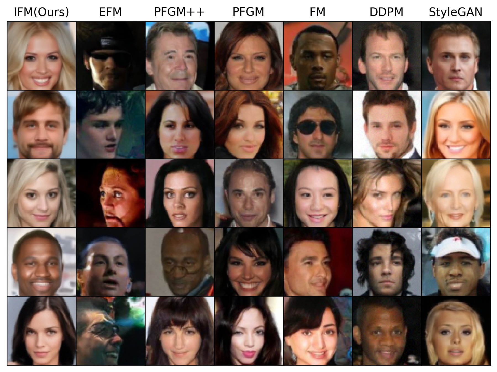
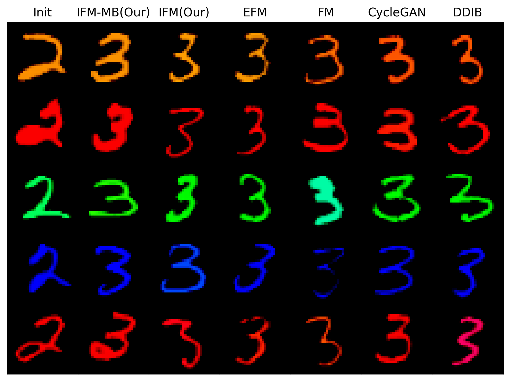
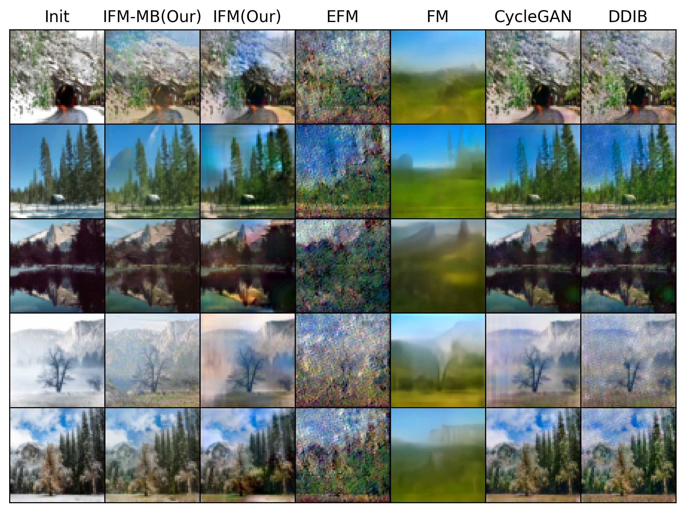

# Interaction Field Matching: Overcoming Limitations of Electrostatic Models (ICLR 2026)

This is the official `Python` implementation of the [ICLR 2026](https://openreview.net/forum?id=GEsTLuJy1q&referrer=%5BAuthor%20Console%5D(%2Fgroup%3Fid%3DICLR.cc%2F2026%2FConference%2FAuthors%23your-submissions)) paper  **Interaction Field Matching: Overcoming Limitations of Electrostatic Models** by Stepan Manukhov,  [Alexander Kolesov](https://scholar.google.com/citations?user=vX2pmScAAAAJ&hl=ru&oi=ao) , [Vladimir V. Palyulin](https://scholar.google.com/citations?user=IcjnBqkAAAAJ&hl=ru&oi=sra) and [Alexander Korotin](https://scholar.google.com/citations?user=1rIIvjAAAAAJ&hl=ru&oi=sra).

The repository contains reproducible PyTorch source code for computing maps for both noise-to-data and data-to-data scenarios in high dimensions with neural networks. Examples are provided for toy 3D, conditional/unconditional data generation and unpaired translation tasks.

<p align="center"></p>

## Pre-requisites

The implementation is GPU-based. Single GPU GTX 1080 ti is enough to run each particular experiment. We tested the code with `torch==2.1.1+cu121`. The code may not work as intended in older/newer `torch` versions. Versions of other libraries are specified in `requirements.txt`. 

 
## Repository structure

All the experiments are issued in the form of pretty self-explanatory jupyter notebooks.

- `src` -  auxiliary source code for constructing the neural network model and preparing data.
- `notebooks/TrainingToyExperiments.ipynb` - the notebook of 3D illustrative examples.
- `notebooks/IFMCelebaGeneration.ipynb` - the notebook of the noise-to-data unconditional generation with [CelebA](https://www.kaggle.com/datasets/jessicali9530/celeba-dataset) dataset.
- `notebooks/IFMCIFAR10Generation.ipynb` - the notebook of the noise-to-data unconditional generation with [CIFAR10](https://www.cs.toronto.edu/~kriz/cifar.html) dataset.
- `notebooks/IFMConditional.ipynb` - the notebook of the noise-to-data conditional generation with [CIFAR10](https://www.cs.toronto.edu/~kriz/cifar.html) dataset.
- `notebooks/IFMSummer2Winter.ipynb` - the notebook of the data-to-data unpaired translation from [Summer to Winter](https://www.kaggle.com/datasets/balraj98/summer2winter-yosemite) landscapes.
- `notebooks/IFMCMTranslation.ipynb` - the notebook of the data-to-data unpaired translation from colored '2' to '3' [MNIST]
(https://yann.lecun.com/exdb/mnist) digits.


## Results  IFM Generation

<table align="center">
  <tr>
    <td align="center">
      <br/>
      <b>CIFAR-10 32x32</b>
    </td>
    <td align="center">
      <br/>
      <b>CelebA 64x64</b>
    </td>
  </tr>
</table>

<p align="center">
  <em>Image Generation: Samples obtained by <b>IFM</b> (ours) with the independent plan, electrostatic-based approaches <b>EFM</b> and <b>PFGM</b> & <b>PFGM++</b>, flow-based <b>FM</b>, diffusion-based <b>DDPM</b> and <b>StyleGAN</b>.</em>
</p>

We also report quantitative results of IFM in Generating task and related works with FID metrics:

| Dataset |  **IFM (Ours)** | **EFM** | **PFGM++** | **PFGM** | **FM** | **DDPM** | **StyleGAN** |
|---------|------------|-----|--------|------|----|------|----------|
| CIFAR-10 (32×32) | **2.28** | 2.62 | 2.15 | 2.76 | 2.99 | 3.12 | 2.48 |
| CelebA (64×64) | **3.07** | >100 | 2.89 | 3.95 | 14.45 | 12.26 | 3.68 |

*Unconditional Image Generation: FID↓ on CIFAR-10 and CelebA for our **IFM**, **EFM**, **PFGM++**, **PFGM**, **FM**, **StyleGAN** and **DDPM**.*


## Results  IFM Translation

<p align="center">
  
  
</p>

<p align="center">
  <b>(a) Colored digits '2' → '3'</b>&nbsp;&nbsp;&nbsp;&nbsp;&nbsp;&nbsp;&nbsp;&nbsp;&nbsp;&nbsp;&nbsp;&nbsp;
  <b>(b) Winter → Summer</b>
</p>

<p align="center">
  <em>Image Translation: Samples obtained by <b>IFM</b> (ours) with/without the minibatch plan, electrostatic-based approach <b>EFM</b>, flow-based <b>FM</b>, diffusion-based <b>DDIB</b> and adversarial <b>CycleGAN</b>.</em>
</p>


We also report quantitative results of IFM in Translation task and related works with CMMD metrics:

| Dataset / Method | **IFM-MB (our)** | **IFM (our)** | **EFM** | **FM** | **CycleGAN** | **DDIB** |
|:---|:---:|:---:|:---:|:---:|:---:|:---:|
| '2' → '3' (32×32) | **0.87** | 0.95 | 0.93 | 1.06 | 0.90 | 0.96 |
| W → S (64×64) | **1.13** | 1.25 | ≫1 | ≫1 | 1.33 | 1.39 |

*Unpaired Image Translation: CMMD↓ on W→S and colored digits '2'→'3' for our **IFM**, **EFM**, **FM**, **CycleGAN** and **DDIB**.*

```console
pip install -r requirements.txt
```
- Download  datasets 
- Set downloaded dataset in appropriate subfolder in `data/`.
- Run notebook with appropriate experiment.